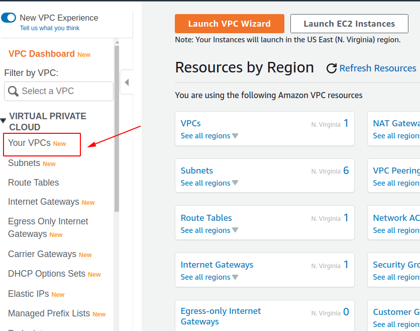
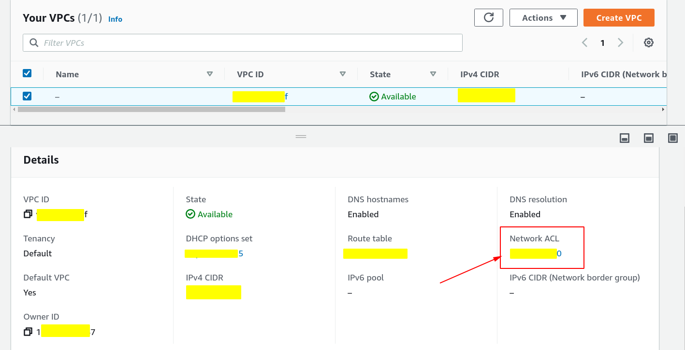
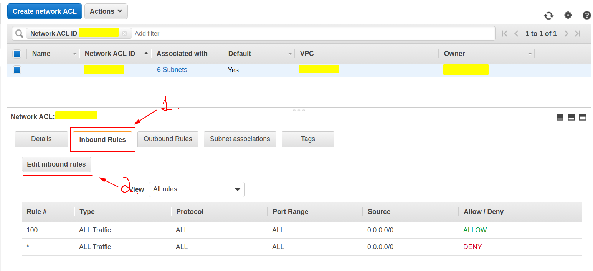
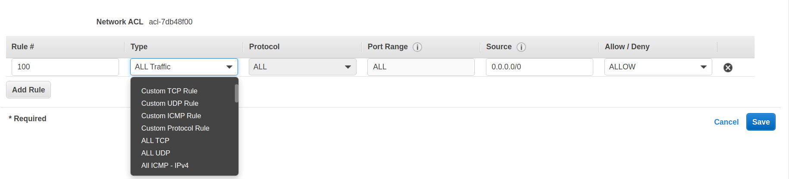

# Foundational and Compute Service
## Elastic Cloud Compute (EC2)
Amazon Elastic Compute Cloud (Amazon EC2) is a web service that provides secure, resizable compute capacity in the cloud. It is designed to make web-scale cloud computing easier for developers. 

## Elastic Block Store (EBS)
Elastic Block Store (EBS) is a storage solution for EC2 instances and is a physical hard drive that is attached to the EC2 instance to increase storage.

### Tips
-   EBS is found on the EC2 Dashboard.
-   There are several EBS volume types that fall under the categories of Solid State Drives (SSD) and Hard Disk Drives (HDD).

## Virtual Private Cloud (VPC)
Virtual Private Cloud or VPC allows you to create your own private network in the cloud. You can launch services, like EC2, inside of that private network. A VPC spans all the Availability Zones in the region.

VPC allows you to control your virtual networking environment, which includes:
-   IP address ranges
-   subnets (can be used to expose what we do or do not want expose to the Internet using publics or private subnets)
-   route tables
-   network gateways

### Tips

-   VPC is found under **Networking & Content Delivery** section of the AWS Management Console.
-   The default limit is 5 VPCs per Region. You can request an increase for these limits.
-   **Your AWS resources are automatically provisioned in a default VPC.**
-   There are no additional charges for creating and using the VPC.
-   **You can store data in Amazon S3 and restrict access so that it’s only accessible from instances in your VPC.**

### VPC Network ACL 
#### Inboud Rules and Outbound Rules
PS: In this session all prints refer to the Inboud Rules Page, but those pages are exactly the same for the Outbound Rules

Rules can allow or deny certain types of web traffic. One possible example could be creating a rule for `SSH`, which dictates who can secure shell or log into the instances.

When a rule is created, a **source** (simple means who can access the server) must be defined. 

- A source determines the traffic that can reach the instance. Specify a single IP address, or an IP address range in CIDR notation (for example, 203.0.113.5/32). If connecting from behind a firewall, you'll need the IP address range used by the client computers

The combo box **Type**, contains all the types of rules that can be created 

## Lambda
AWS Lambda provides you with computing power in the cloud by allowing you to execute code without standing up or managing servers.

### Tips
-   Lambda is found under the Compute section on the AWS Management Console.
-   Lambdas have a time limit of 15 minutes.
-   The code you run on AWS Lambda is called a “Lambda function.”
-   Lambda code can be triggered by other AWS services.
-   AWS Lambda supports Java, Go, PowerShell, Node.js, C#/.NET, Python, and Ruby. There is a Runtime API that allows you to use other programming languages to author your functions.
-   Lambda code can be authored via the console.

## Elastic Beanstalk
Elastic Beanstalks is an orchestration service that allows you to deploy a web application at the touch of a button by spinning up (or provisioning) all of the services that you need to run your application.

### Tips
-   Elastic Beanstalk is found under the Compute section of the AWS Management Console.
-   Elastic Beanstalk can be used to deployed web applications developed with Java, .NET, PHP, Node.js, Python, Ruby, Go, and Docker.
-   You can run your applications in a VPC.

## Resources
### Elastic Cloud Compute (EC2)

### Elastic Block Store (EBS)

### Virtual Private Cloud (VPC)
-   [Virtual Private Cloud](https://en.wikipedia.org/wiki/Virtual_private_cloud)
-   [Amazon Virtual Private Cloud](https://aws.amazon.com/vpc/)
-   [Amazon VPC Documentation](https://docs.aws.amazon.com/vpc/latest/userguide/what-is-amazon-vpc.html)

### Lambda
-  [AWS Lambda](https://aws.amazon.com/lambda/)