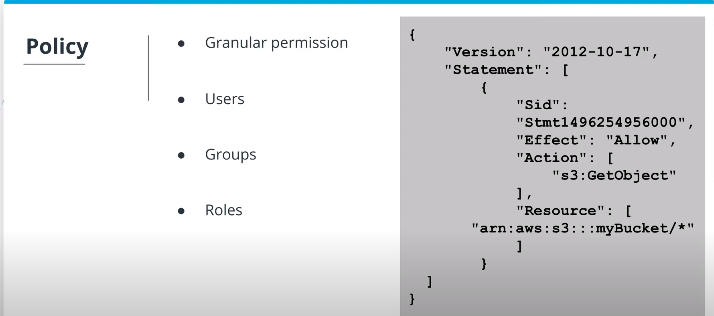

# Security
## WS Shield
AWS Shield is a managed DDoS (or Distributed Denial of Service) protection service that safeguards web applications running on AWS.

AWS Shield is a service that you **get "out of the box",** it is always running (automatically) and is a part of the free standard tier. If you want to use some of the more advanced features, you'll have to utilize the paid tier.

### Tips
-   AWS Shield can be found under the Security, Identity, & Compliance section on the AWS Management Console.
-   AWS Shield Standard is always-on, using techniques to detect malicious traffic.
-   AWS Shield Advanced provides enhanced detection.

## AWS WAF
AWS WAF (or AWS Web Application Firewall) provides a firewall that protects your web applications.

WAF can stop common web attacks (sql injection, cross-site scripting, etc), by reviewing the data being sent to your application and stopping well-known attacks.

### Tips
-   WAF is found under the Security, Identity, & Compliance section on the AWS Management Console.
-   WAF can protect web sites not hosted in AWS through Cloud Front.
-   You can configure CloudFront to present a custom error page when requests are blocked.

## Identity and Access Management (IAM)
Identity & Access Management (IAM) is an AWS service that allows us to configure who can access our **AWS account, services, or even applications running** in our account. IAM is a global service and is automatically available across ALL regions.

**Concept**: Least Privilege Access

IAM User is an entity that you create in AWS to represent the person or service that interacts with services or applications running in your AWS account. An user in AWS consists of a username and access credentials like, password or access key

IAM Group is a collection of users. It facititates the specification of permissions for several users at same time.

IAM Role is an identity with permissions or a set of privileges that **are not associated with a specific IAM user or IAM group**. Roles can be attached to a single user and this user can assuma a single temporarily role to perform a task.

Policy is used to create granular level permission and can be attached to users, groups and roles. AWS provides a pre-defined list of policies. 

Ex: Everyone has access to an S3 bucket called mybucket

## Resources
### AWS WAF
-   [AWS Web Application Firewall](https://aws.amazon.com/waf/)

### IAM 
-   [AWS IAM Overview](https://aws.amazon.com/iam/)
-   [What is IAM](https://docs.aws.amazon.com/IAM/latest/UserGuide/introduction.html)