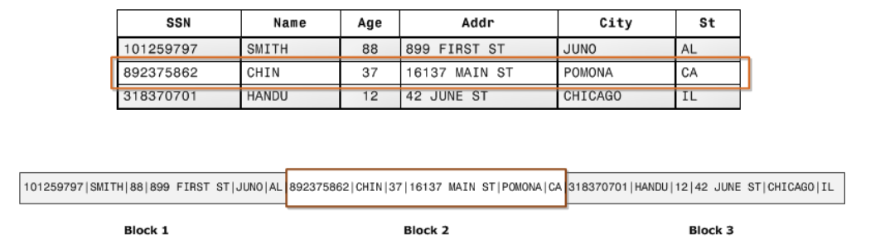
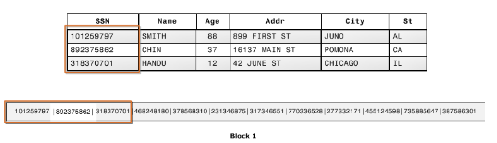

# Storage and Content Delivery
## S3 & S3 Glacier
Amazon Simple Storage Service (or S3) is an object storage system in the cloud. It is like a file system in the cloud

### Buckets
- Objects are stored in buckets
- Holds millions of objects
- Buckets live in a region
- Buckets name must be globally unique

### S3 Use Cases
- Static websites
- content delivery
- backup and recovery
- archiving and big data
- application data

### Storage Classes
S3 offers several storage classes, which are different data access levels for your data at certain price points. storage classes are basically different data access levels.
- S3 Standard
- S3 Glacier
- S3 Glacier Deep Archive
- S3 Intelligent-Tiering
- S3 Standard Infrequent Access
- S3 One Zone-Infrequent Access

**Ex:** The class S3 Glacier is more for data archiving purposes, and the type of data placed must be not intend to be access frequently. S3 Glacier can be used to store large log file that are generated Monthly. It must be stored because it will be consulted once a year by the auditors

### Tips
-   S3 is found under the Storage section on the AWS Management Console.
-   A single object can be up to 5 terabytes in size.
-   You can enable Multi-Factor Authentication (MFA) Delete on an S3 bucket to prevent accidental deletions.
-   **S3 Acceleration**  can be used to enable fast, easy, and secure transfers of files over long distances between your data source and your S3 bucket.

TODO -  Take print S3 properties page

## DynamoDB
DynamoDB is a NoSQL document database service that is fully managed. Unlike traditional databases, NoSQL databases, are schema-less. Schema-less simply means that the database doesn't contain a fixed (or rigid) data structure. Additionally, data is stored in JSON or JSON like text. Each row or a record,inn a DynamoDB table is called a document.

### Tips
-   DynamoDB is found under the Database section on the AWS Management Console.
-   DynamoDB can handle more than 10 trillion requests per day.
-   DynamoDB is serverless as there are no servers to provision, patch, or manage.
-   DynamoDB supports key-value and document data models.
-   DynamoDB synchronously replicates data across three AZs in an AWS Region.
-   DynamoDB supports GET/PUT operations using a primary key

## Relational Database Service (RDS)
RDS (or Relational Database Service) is a service that aids in the administration and management of databases. RDS assists with database administrative tasks that include upgrades, patching, installs, backups, monitoring, performance checks, security, etc.

### Database Engine Support
-   Oracle
-   PostgreSQL
-   MySQL
-   MariaDB
-   SQL Server

### Features
-   failover
-   backups
-   restore
-   encryption
-   security
-   monitoring
-   data replication
-   scalability

## Redshift
Redshift is a cloud data warehousing service to help companies manage big data. Redshift allows you to run fast queries against your data using SQL, ETL, and BI tools. Redshift stores data in a column format to aid in fast querying.

Redshift was not designed for transaction processing and usually contains historical data from transactional systems.

Ex: Imagine a web site that allows users to order product online. The more recent transactions, like the orders for the current year, may live in a relational database like oracle, because it may need to be accessed them during day-to-day operations. However, orders from 10 years ago, maybe archived to a data warehouse like Redshift.

### Columnar Store Format vs Row Store Format
Columnar storage for database tables is an important factor in optimizing analytic query **performance** because it drastically **reduces the overall disk I/O** requirements and reduces the amount of data you need to load from disk.

#### Row Store Format
This illustration bellow shows how records from database tables are typically stored into disk blocks by row. 

**Data blocks** store values sequentially for each consecutive column of a row.

- If block size is smaller than the size of a record, storage for an entire record may take more than one block.

- If **block size is larger than the size of a record**, storage for an entire record may take less than one block, **resulting in an inefficient use of disk space**

In **online transaction processing** (OLTP) applications, most transactions involve frequently reading and writing all of the values for entire records, typically one record or a small number of records at a time. As a result, **row-wise storage is optimal for OLTP databases.**

#### Columnar Store Format
The illustration bellow shows how with columnar storage, the values for each column are stored sequentially into disk blocks.

Using columnar storage, each data block stores values of a single column for multiple rows.

In the above simplified example, using columnar storage, each data block holds column field values for as many as three times as many records as row-based storage. This means that reading the same number of column field values for the same number of records requires a third of the I/O operations compared to row-wise storage. In practice, using tables with very large numbers of columns and very large row counts, storage efficiency is even greater.

An added advantage is that, since each block holds the same type of data, block data can use a compression scheme selected specifically for the column data type, further reducing disk space and I/O.

Where OLTP transactions typically involve most or all of the columns in a row for a small number of records, data warehouse queries commonly read only a few columns for a very large number of rows.

## Tips
-   Redshift can be found under the Database section on the AWS Management Console.
-   Redshift delivers great performance by using machine learning.
-   Redshift Spectrum is a feature that enables you to run queries against data in Amazon S3.
-   Redshift encrypts and keeps your data secure in transit and at rest.
-   Redshift clusters can be isolated using Amazon Virtual Private Cloud (VPC).

## Content Delivery In The Cloud
A Content Delivery Network (or CDN) speeds up delivery of your static and dynamic web content by caching content in an Edge Location close to your user base.

### Benefits
The benefits of a CDN includes:
-   low latency
-   decreased server load
-   better user experience

## Cloud Front
CloudFront is used as a global content delivery network (CDN). Cloud Front speeds up the delivery of your content through Amazon's worldwide network of mini-data centers called Edge Locations.

CloudFront works with other AWS services, as shown below, as an origin source for your application:
-   Amazon S3
-   Elastic Load Balancing
-   Amazon EC2
-   Lambda@Edge
-   AWS Shield

> Create a web distribution if you want to:
> -   Speed up distribution of static and dynamic content, for example, .html, .css, .php, and graphics files.
> -   Distribute media files using HTTP or HTTPS.
> -   Add, update, or delete objects, and submit data from web forms.
> -   Use live streaming to stream an event in real time.

> You store your files in an origin - either an Amazon S3 bucket or a web server. After you create the distribution, you can add more origins to the distribution.

### Tips

-   CloudFront is found under the Networking & Content Delivery section on the AWS Management Console.
-   Amazon countinously adds new Edge Locations.
-   CloudFront ensures that end-user requests are served from the closest edge location.
-   CloudFront works with non-AWS origin sources.
-   You can use GeoIP blocking to serve content (or not serve content) to specific countries.
-   Cache control headers determine how frequently CloudFront needs to check the origin for an updated version your file.
-   The maximum size of a single file that can be delivered through Amazon CloudFront is 20 GB.

## References
### S3 & S3 Glacier
-   [Amazon S3](https://aws.amazon.com/s3/)
-   [Amazon S3 Glacier](https://aws.amazon.com/glacier/)
-   [What is Amazon S3 Glacier](https://docs.aws.amazon.com/amazonglacier/latest/dev/introduction.html)

### DynamoDB
-   [Amazon DynamoDB Overview](https://aws.amazon.com/dynamodb/)
-   [What is Amazon DynamoDB](https://docs.aws.amazon.com/amazondynamodb/latest/developerguide/Introduction.html)

### RDS
-   [What Is A Relational Database](https://aws.amazon.com/relational-database/)
-   [Amazon Relational Database Service](https://aws.amazon.com/rds/)
-   [AWS Product Databases using Relational Databases](https://aws.amazon.com/products/databases/)

### Redshift
-   [What Is Amazon Redshift](https://docs.aws.amazon.com/redshift/latest/mgmt/welcome.html)
-   [Amazon Redshift Overview](https://aws.amazon.com/redshift/)