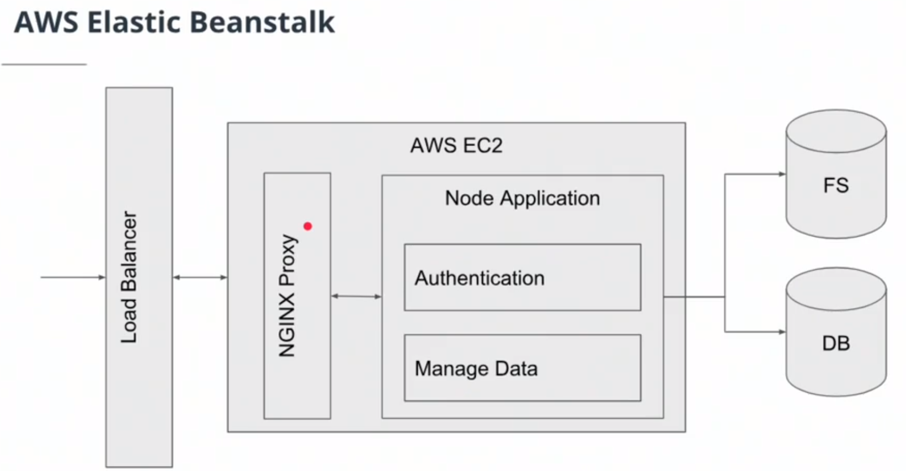
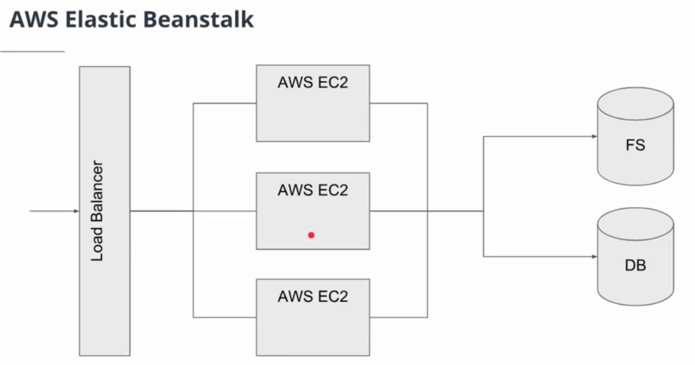

# Building and Deploying
### AWS Elastic Beanstalk
Elastic Beanstalk is a powerful Development Operations tool (Dev Ops) to deploy your code to AWS services and infrastructure with minimal effort.





- NGINX Proxy acts like a reverse proxy or proxy server that sits in front of the app within the EC2 instance. It will take external traffic and route it internally within that instance to a running application

#### Installing Elastic Beanstalk CLI
[Install the EB CLI](https://docs.aws.amazon.com/elasticbeanstalk/latest/dg/eb-cli3-install.html#eb-cli3-install.scripts)

```
Note: To complete installation, ensure `eb` is in PATH. Ensure this by executing:

    1. Bash:
       echo 'export PATH="/home/augusto/.ebcli-virtual-env/executables:$PATH"' >> ~/.bash_profile && source ~/.bash_profile
```

#### `eb init`
After running the `eb init` command and following the guided setup will create a new directory in project named `.elasticbeanstalk`. Within this configuration file, there is a configuration file named `config.yml`. This is the set of instructions Elastic Beanstalk will follow when provisioning your AWS infrastructure and deploying your code.

#### `eb create`
Upload the project to the Elastic Beanstalk

#### Permissions for Elastic Beanstalk - IAM Configuration
1. IAM > Users > 
	- Added Permissions:
		- AdministratorAccess (temp)
		- AWSElasticBeanstalkFullAccess (temp)
		
2. IAM > Roles > aws-elasticbeanstalk-ec2-role
	-	Attached Policy - udagram_media_dev_s3 
	-	The recomendation is to create a "clone" of aws-elasticbeanstalk-ec2-role for each new instance of elastic beanstalk created


### Reverse Proxy
> In computer networks, a reverse proxy is a type of proxy server that retrieves resources on behalf of a client from one or more servers. These resources are then returned to the client, appearing as if they originated from the reverse proxy server itself.
> \- Wikipedia
