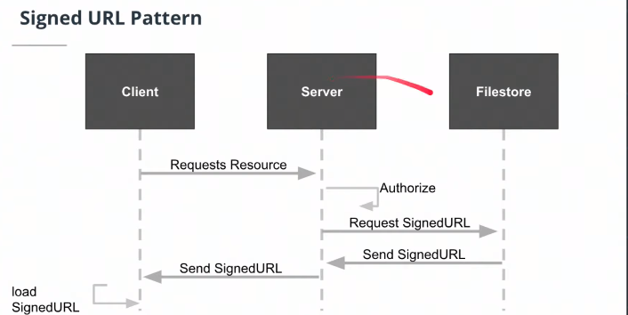
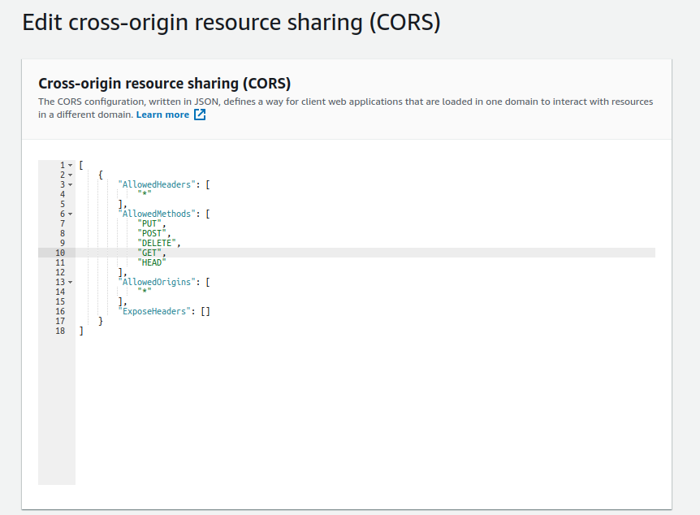

# Storing Data in the Cloud
### Filestore 
- **Filestore vs Database**
	- Database are great for structured data, small fields and things that are going to be searched for complex types of queries. This type of data is expensive to store, because besides the data itself, things such as indexes and all of the over head associated with finding that information 
	- Filestore allows to store large bits of information with lower cost (images, videos or documents)

-   File stores allow for archiving data. In AWS, the file store is called S3, and the archive resource is called “glacier”.
-   Content Delivery Network (CDN): are a network of proxy servers that are **placed closer to end users** to deliver data and compute. CDNs reduce **latency** for end users.
- Buckets: a simple directory-like system in which to store data.

#### SignedURLs
SignedURLs allow clients to send and receive data by directly communicating with the file store. This saves the server from using its bandwidth to serve as the intermediary that transmits data to and from the client. This is faster for clients as well.

> We don't have to take our large files from our client, pass it through our server and dump it into our file system. Instead it is more efficient use a design patter called **signedURLs**, which will save us tremendous amounts of bandwith

The client will make a request to the server  in order to store some kind of data. The server will make a quick handshake with our file to store and then return back a URL that the client can directly upload data. Now the server infrastructure does not need to intermediate this proccess.



### S3 as Filestore
[Configuring S3 Cross-Origin Resource Sharing](https://docs.aws.amazon.com/AmazonS3/latest/dev/cors.html#how-do-i-enable-cors)

#### CORS
CORS: Cross Origin Resource Sharing: defines how a client can interact with a resource, and what the client can and cannot do with that resource. Setting the CORS policy of our S3 bucket allows our client to communicate with the S3 bucket using the SignedURL pattern.



---

> Cross-Origin Resource Sharing (CORS) is a protocol that enables scripts running on a browser client to interact with resources from a different origin. This is useful because, thanks to the [same-origin policy](https://developer.mozilla.org/en-US/docs/Web/Security/Same-origin_policy) followed by `XMLHttpRequest` and `fetch`, JavaScript can only make calls to URLs that live on the same origin as the location where the script is running. For example, if a JavaScript app wishes to make an AJAX call to an API running on a different domain, it would be blocked from doing so thanks to the same-origin policy.

>Most of the time, a script running in the user's browser would only ever need to access resources on the same origin (think about API calls to the same backend that served the JavaScript code in the first place).

>**Identifying a CORS Response**
When a server has been configured correctly to allow cross-origin resource sharing, some special headers will be included. Their presence can be used to determine that a request supports CORS. Web browsers can use these headers to determine whether or not an  `XMLHttpRequest`  call should continue or fail.
\- Auth0 - CORS Tutorial: A Guide to Cross-Origin Resource Sharing


### Further Research
- [Auth0 - CORS Tutorial: A Guide to Cross-Origin Resource Sharing](https://auth0.com/blog/cors-tutorial-a-guide-to-cross-origin-resource-sharing/)
- [Codecademy - What is CORS?](https://www.codecademy.com/articles/what-is-cors)

### Understanding Secrets
-   Use environment variables to store your username and password, to avoid hard-coding username and password information in your code.
-   Avoid committing your passwords to git. Use .gitignore to define files that you do not want to commit to git.
-   IAM user role: an IAM role can give a user a set of permissions to access one or more services.
-   IAM service role: an IAM role gives a service a set of permissions to access one or more services.


### User IAM Profiles AWS
- Policy groups: It will aggregate multiples types of permissions into a single unit that can be assigned to a user.
- Policy permission: It will directly assign different permissions to an user.


-   It’s beneficial to create a role that contains a policy group (a set of permissions), rather than to assign individual permissions to a specific user. Imagine if a user leaves the company and a new hire takes their place. Instead of re-assigning all the permissions needed for their job, we can assign the existing IAM role to that new employee.

#### Installing AWS User IAM Profiles Locally
#### Clarification on AWS Configuration Files
After installing Amazon Web Services credentials using the  `aws configure`  terminal command. This creates two new files on your local computer to save credentials and configurations.

Each of these files can contain settings for multiple "profiles" which are defined by using hard brackets containing the profile name preceding the variables (i.e.  `[profile1]`). 

>For example, if you're working on two or three systems, you will need installed credentials for each. You can modify these files in your text editor of choice to add and edit profiles and select the appropriate profile at runtime of your application. Additional information on these files can be found in the  [AWS Docs](https://docs.aws.amazon.com/cli/latest/userguide/cli-configure-files.html).

**Below are some sample file contents with multiple profiles:**

`~/.aws/credentials`

```
[default]
aws_access_key_id=########################
aws_secret_access_key=########################

[profile1]
aws_access_key_id=########################
aws_secret_access_key=########################

[profile2]
aws_access_key_id=########################
aws_secret_access_key=########################

```

`~/.aws/config`

```
[default]
region=us-east-1

[profile1]
region=us-west-2

[profile2]
region=us-east-2
```