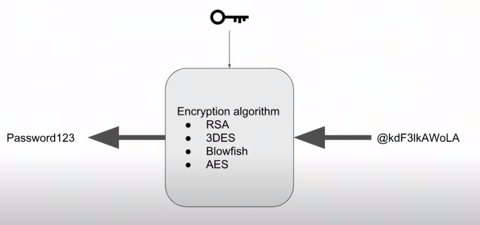

# User Authentication and Security
## Authentication
Authentication is about validating the identity of a client attempting to call a web service. Typically, identity is validated with user credentials, such as a user name and password.

## Authorization
Authorization is the next step after authentication. So once a client is authenticated (they have proven who they are), what do they have access to? For example, what data can they view, are they allowed to change that data, etc.

## Password Encryption and Decryption



- It is possible to revert de encryptation and retrive the password

## Hashing, Rainbow Tables and Salt
### One Way Hash


### Rainbow Tables


### Salt


Current Gold Standard (or best method) of storing passwords make usage of salted, hashed string using bcrypt.


### Adding `bcrypt` to the Project
```
import * as bcrypt from 'bcrypt';

npm i bcrypt --save
npm i --save-dev @types/bcrypt
```

### BCrypt Clarification
```js
const  saltRounds = 10;
const  salt = await  bcrypt.genSalt(saltRounds);
const  hash = await  bcrypt.hash(plainTextPassword, salt);
```

**Salt Rounds**: the password is passed through the salted hashing function, and the output is again passed through the hashing function in a loop. The more times we iterate on the hashing function, the more we can guard against brute force attacks that try to guess the password. 
The salt rounds decide how many times to go through this loop. **Settings salt rounds to 10 means we iterate on this hashing function 2^10 times.**

```js
const  compare = await  bcrypt.compare(plainTextPassword, hash);
```

**Comparing Passwords**: When you're using the  `bcrypt.compare`  method, it may appear that the salt is ignored. However, if you look closely at the example outputs in the video above, it is clear that the salt is actually prepended to the hash which we are using in the compare method. In other words, when we save the hash in our database - it is storing  _both_  the salt and the resulting hash as one value. Then, when comparing the plain text password, the stored salt and hash are split and the salt is used to produce the new hash, which is ultimately what is being compared.

## Sessions, JWTs, and Environment Variables 
The client can be a web browser or another server. In either of these cases, it needs to send some authentication information along with each request.

On the web browser, this is most commonly performed by storing some kind of credentials in something like the [localstorage](https://developer.mozilla.org/en-US/docs/Web/API/Window/localStorage) which allows to store information for a specific site in a key-value store. JSON Web Tokens are one type of credential that can be stored locally in this fashion.


### JWT
> JSON Web Token (JWT) is an open standard (RFC 7519) that defines a compact and self-contained way for securely transmitting information between parties as a JSON object.  [font](https://jwt.io/introduction/)

**Integrity** One good point of using JWT is the integrity of the informatioin contained within the JSON Web Token. And speaking of integrity, it means that there are the guarantee that the contend was not motified. Moreover, when tokens are signed, the signature also certifies that only the party holding the private key is the one that signed it.

**Brief Recap of Signature Concept**
> **signature:**  Anyone with access to Alice's public key can verify that a message (signature) could only have been created by someone with access to Alice"s private key

The JWT is used for further iteractions after the user authentication

#### JWT Possible Workflow


#### Verifying Signature


#### JWT vs SessionID - Authorization Strategies
- The session token is a **reference token**, the server can use this information to search for user information / session / state stored on the server side.
- JWT is a value token, it contains all the information itself

#### How secure is a JWT if it is readable by anyone?

#### What if someone steals my JWT and uses it themselves?

#### How do you disable JWT?

### Node and JWT
 - Library `jsonwebtoke`

### Node - Requiring Auth to Restrict Endpoint Usage
Each protected endpoint adds a middleware function `requireAuth` which is defined in the `auth.router.ts` file. This method will check if the authorization header exists and is a valid JWT. If yes, it allows the endpoint to continue processing. If no, it rejects the request and sends appropriate HTTP status codes.

```js
import { requireAuth } from  '../../users/routes/auth.router';

router.get('/signed-url/:fileName',
    requireAuth,
    async (req: Request, res: Response) => {
        let { fileName } = req.params;
        const url = AWS.getPutSignedUrl(fileName);
        res.status(201).send({ url: url });
    });
```

### 2. Environment Variables - Linux/Mac Users
Assume you store the user-specific secrets, such as username, password, or private key, into a simple file. It might not be a safe approach because all the sensitive information may become public if you put that information on Github/any other Version Control System. User-specific secrets, visible publicly, are never a good thing.

Here comes the role of Environment variables in this scenario. Environment variables are pretty much like standard variables, in that they have a name and hold value. The environment variables only belong to your local system and won't be visible when you push your code to a different environment like Github.

#### a. The  `.env`  file
The  `.env`  file is one of the  _hidden_  files in which you can store your choice of environment variables. The variables stored in this file are your individual working environment variables.  **_Note that the environment variables that are stored in the  `.env`  file override the variables set in the  `/etc/environment`  file, that is shared by all users of that computer._** You will need to follow the steps below to configure environment variables in a  `.env`  file:

1.  **Install environment variables package**  -    
    ```
    npm install dotenv --save
    
    ```
    
    This will allow you to use the environment variables that you'll set in a new file.

2.  **Create a new  `.env`  file**  in the root of your project. Fill the  `.env`  file with your new variables, and their corresponding values. For example:
    
    ```
    POSTGRES_USERNAME = yourUsername
    POSTGRES_PASSWORD = yourpassword
    AWS_REGION = yourAWSRegion
    AWS_PROFILE=awsProfileName
    
    ```
        
3.  **Require the package in your server**  - Add the following code on top of the  `server.ts`  file
    
    ```
    require('dotenv').config();
    
    ```
    
4.  **Use your environment variables**  - If you want to refer the environment variables that you just saved in the  `.env`  file, anywhere in the code, try putting a prefix  `process.env.`  in front of the variable name. For example,  `process.env.POSTGRES_USERNAME`  will fetch you the value stored in it.

5.  **Add  `.env`  to your  `.gitignore`**  - You wouldn't want your  `.env`  file to be available publicly in the project Github repository. For this reason, go to the  `.gitignore`  file in the project root, and add and entry  `.env`  to it. It will make sure that you don't push our environment variables to Github!

#### b. The  `process.env`  file
The  `process.env`  file is a default file that stores the variables for the current terminal environment. When you run the following command, it will store the  `POSTGRES_USERNAME`  to the current terminal environment:

```
export POSTGRES_USERNAME = yourUsername

```

By default, the Node is accessing the same set of variables that are defined in your  `process.env`  file.

#### c. Bash Profile -  `.profile`  file
You won't want to export the user-specific variables  _every time_  you'll log in to your system, and do not want to override the variables set in the root level  `/etc/environment`  file. The solution is to store the new variables  _either_  in  `.profile`,`.bashrc`  or  `.zshrc`  file, depending on your shell. These are the files that the shell executes even before you type your first command to it.  **_Note that every user of the computer has its own  `.profile`  file._**

When you put

```
export AWS_PROFILE=awsProfileName

```

inside the  `.profile`  file, it will run this command before you start firing commands in your shell.

Usually, the bash profile is found at  `~/.profile`, where  `~`  represents your current logged in user's home directory. Keep in mind the  `.`  preceding profile means this file will be hidden.

If you wish to instruct your Node to execute the  `.profile`  file anytime, you can run the following command:

```
source ~/.profile

```

#### d. Using the Manual Page -  `man`  command
Most Bash commands in the terminal give you instructions on how to use them when you type  `man <command>`  where  `<command>`  could be any CLI command. For example, typing  `man bash`  into the terminal will give you the manual page for  `bash`.

The  _INVOCATION_  section of the  `man`  page will give you some hints to where bash looks for profiles when starting.

### 3. Environment Variables - Windows Users
Windows has the same concept of variable stored at the OS level to use within and across applications. Windows has two types of Environment Variables:

-   **User Environment Variables**  which are accessible only to the currently logged in user
-   **System Environment Variables**  which are available  _all_  users on the machine

##### Setting Windows Environment Variables

Environment variables are set on Windows using a GUI (Graphical User Interface). On Windows 10, this can be found by:

1.  From the start menu, right-click the  `Computer`  icon
2.  Select  `Properties`
3.  Select  `Advanced System Settings`  on the left
4.  In the new window, click  `Environment Variables`
5.  Use the  `New...`  and  `Edit...`  buttons to set and modify your variables

You can follow  [this handy guide](https://www.computerhope.com/issues/ch000549.htm)  for your flavor of Windows.

### 4. Run Linux Environment on Windows

Windows OS also has a concept of the shell. The default shell in Windows is the command-line tool  **Cmd.exe**. There is another shell available in Windows 7 SP1and above,  [PowerShell](https://docs.microsoft.com/en-us/powershell/scripting/windows-powershell/install/installing-windows-powershell?view=powershell-7). PowerShell is primarily used for Windows system administration. Neither CMD nor PowerShell can run bash, ssh, git, apt, or any Linux commands by default.

The solution is to use  _either_  of the options below:

#### Option 1 - Windows Subsystem for Linux

[Windows Subsystem for Linux](https://docs.microsoft.com/en-us/windows/wsl/about)  (WSL) - WSL allows us to run Linux environment, including most command-line tools, utilities, and applications, from the Windows Command Prompt (CMD). You can even mix the Linux and Windows commands after installing WSL. Refer to the installation instructions  [here](https://docs.microsoft.com/en-us/windows/wsl/install-win10)  to install WSL on Windows.

The next step is to install and run a Linux distribution parallelly on WSL. There are multiple choices for installing - Ubuntu, OpenSUSE, Debian, and many more. If you have no preference, you can install  [Ubuntu on Windows](https://www.microsoft.com/en-us/p/ubuntu/9nblggh4msv6?activetab=pivot:overviewtab)  App, and proceed as mentioned in the installation instructions above.

#### Option 2 - Git Bash on Windows

Git is an open-source distributed Version Control System (VCS). Github is a repository hosting and version control service, where you can store, share, or download the repository content in collaboration with multiple contributors. Git provides a Unix style command-line tool called  [Git for Windows](https://git-scm.com/download/win)  to help users work with Github repositories. Once you download and install Git for Windows, you can start executing Git commands either in CMD or a GUI.

[Git Bash](https://www.atlassian.com/git/tutorials/git-bash)  is a command-line tool by default included in Git for Windows. Besides running Git commands, Git Bash allows users to run Linux/Bash commands as well.

## Deploying Our Server to the Cloud - EB CLI
After running the `eb init` command and following the guided setup will create a new directory in the project named `.elasticbeanstalk`. Within this configuration file, there is a configuration file named `config.yml`. This is the set of instructions Elastic Beanstalk will follow when provisioning your AWS infrastructure and deploying the code.

### Udagram Build and Deploy - EB CLI
After running  `npm run build`  to transpile and package our code into a zip, we need to configure Elastic Beanstalk to use this build archive. This is accomplished with the following addition to the .easticbeanstalk/config.yml configuration file:

```
deploy:
    artifact: ./www/Archive.zip
```