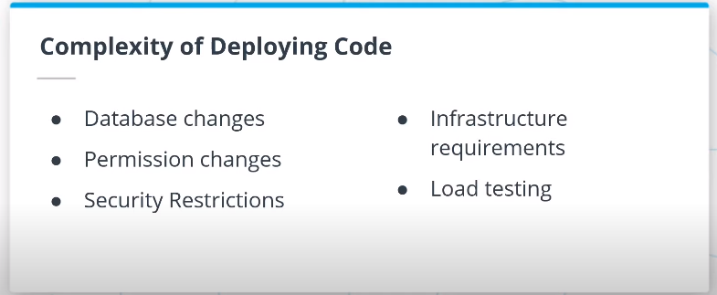
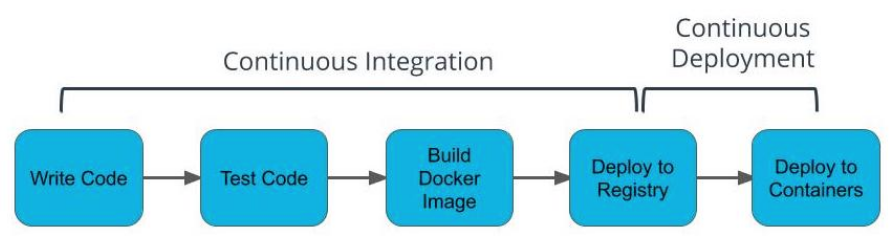
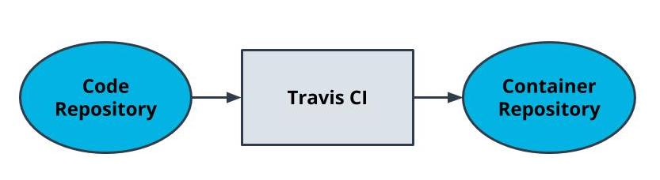

# Automating Application Development Lifecycle

## Deploying Code


### Code After Coding
Once the code is done, how to  _ship_  it? Typically, the software development cycle will proceed with building the code, installing all of the dependencies, running automated tests, manually testing, and then repeating for each development environment the application needs to be deployed to.

-   It’s a common fallacy to underestimate the time it takes to deploy code
-   Teams deploying enterprise software often involves many internal and external dependencies that may include: infrastructure changes, security changes, permissions provisioning, load testing

## CI/CD Benefits


CI/CD allows to have a streamlined process for how our code transforms from being written to being deployed to production.

### Continuous Integration
Process in which code is tested, built into a Docker image, and deployed to a container registry.

### Continuous Deployment
Process in which our Docker image is deployed to containers.

### Additional Benefits
By streamlining the build and deploy to an automated process, developers are provided the least privilege that they need to write their code.

By using a CI/CD pipeline, the risk of failed deployments from user error is reduced. All of these steps can become automated. If there is an issue with the deployed code, a user can revert the changes with an older container rather than backtracking by using older code and downgrading packages and dependencies.

-   Reduce risk of failed deployments
-   Connecting to a production environment is a security risk
-   Backing up the code is not always a comprehensive backup of the existing state since we may have other dependencies such as databases
-   Packages and dependencies may have to be downgraded and would introduce downtime

### "Ship Early, Ship Often"
-   CI/CD allows for a tight feedback loop
-   Bugs are inevitable -- CI/CD helps us identify them in a deployed environment
-   CI/CD makes the pipeline more available.Once developed, the pipeline can be reused by any other developer on the team to build and deploy the application. No need to study or understand the intricacies of deploying code

### Additional Reading
The following information is available for further reading on key ideas for deploying code.
-   [Ship Early and Often](https://blog.ycombinator.com/tips-ship-early-and-often/)

## Travis CI
-   Travis is a tool that helps with the CI process
-   Travis integrates with applications using a YAML file
-   YAML files are often used to specify configurations.
-   Travis can be used to build and push images to DockerHub

### Travis File

The Travis file is always named  `.travis.yaml`  and stored in the top-level of your git directory. This is detected by Travis CI and turned into a build pipeline.

```yaml
language: node_js
node_js:
  - 13

services:
  - docker

# Pre-testing installs
install:
  - echo "nothing needs to be installed"

# Scripts to be run such as tests
before_script:
  - echo "no tests"

script:
  - docker --version # print the version for logging
  - docker build -t simple-node .
  - docker tag simple-node YOUR_DOCKER_HUB/simple-node:latest

# Tasks to perform after the process is successful. Formatting the Docker username and password as below enables you to programmatically log in without having the password exposed in logs.
after_success:
  - echo "$DOCKER_PASSWORD" | docker login -u "$DOCKER_USERNAME" --password-stdin
  - docker push YOUR_DOCKER_HUB/simple-node
```




### Additional Reading
-   [Travis CI Features](https://docs.travis-ci.com/user/for-beginners/)