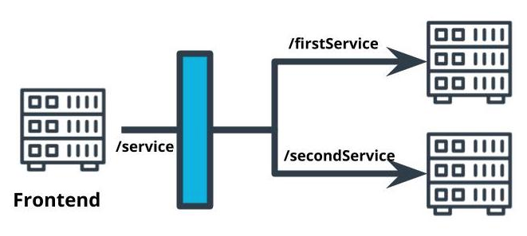
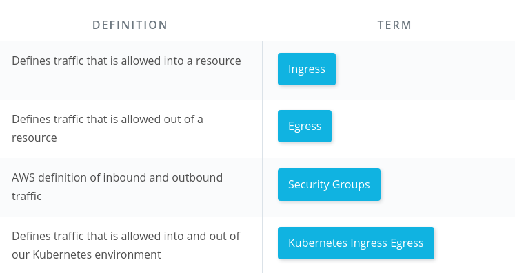
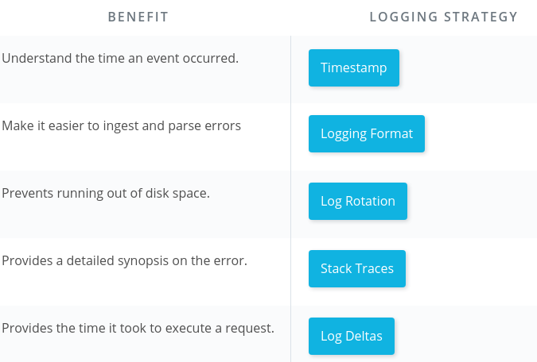

# Best Practices Design Pattern
## Reverse Proxy
- A single interface that forwards requests on behalf of the client and appears to the client as the origin of the responses.
- Useful for abstracting multiple microservices to appear as a single resource.



**Architecture Seen by the Client**


### API Gateway
**A form of a reverse proxy** that serves as an abstraction of the interface to other services.
- This pattern helps clean up the code and abstract common logic by moving common API logic to the reverse proxy layer, 

**Example:** Rather than each microservice implementing its own authentication, we can configure our **least privilege access** such that microservice will only accept traffic from the reverse proxy. Then we can move authentication to the reverse proxy and thereby reduce complexity of our code and standardize tthe authenticatiion logic in a single place.

### API Gateway vs. Library
Both, API Gateway and Library are used to abstract common code. This helps us reduce the complexity of our applications by removing boilerplate code or duplicate logic. 

#### Properties of a library
A library contains common code that must be imported into our service. While the logic is abstracted, there is still some overhead of management library (We have to make sure the versions are consistent, when a new version of the library is released, every service that imports that library will need to be updated accordingly. 

Also, abstraction of common code is in the same programming language.

### API Gateway Proxy
**An API Gateway is an abstraction of an interface**, this means that the common code and common logic is **limited to our inputs and outputs**. This means that our points of abstraction can be not as flexible as a library. However the only need is that the logic can be implemented once, and the microservices that appoints to does not need to care.

A good feature of API Gateway is that it has its own technology stack. This means that there are two microservices that are using diffenrent programming languages, we can still have an abstraction of the common logic.

## Setting up the Reverse Proxy on Kubernates 

### **Dockerfile**
```
FROM nginx:alpine

COPY nginx.conf /etc/nignx/nginx.conf
```


### **Sample bare-bones  `nginx.conf`  file:**

```
events {
}
http {
  server {
      listen <PORT_NUMBER>;
      location /<PROXY_PATH>/ {
          proxy_pass http://<REDIRECT_PATH>/;
      }
  }
}
```

### **Example of ** `nignx.conf`
```
events {
}
http {
    server {
        listen 8080;
        location /api/ {
            proxy_pass http://my-app-2-svc:8080/;
        }
    }
}
```

### **_deployment.yaml_**
```
apiVersion: extensions/v1beta1
kind: Deployment
metadata:
  labels:
    service: reverseproxy
  name: reverseproxy
spec:
  replicas: 1
  template:
    metadata:
      labels:
        service: reverseproxy
    spec:
      containers:
      - image: YOUR_DOCKER_HUB/simple-reverse-proxy
        name: reverseproxy
        imagePullPolicy: Always          
        resources:
          requests:
            memory: "64Mi"
            cpu: "250m"
          limits:
            memory: "1024Mi"
            cpu: "500m"       
        ports:
        - containerPort: 8080
      restartPolicy: Always

```

### **_service.yaml_**
```
apiVersion: v1
kind: Service
metadata:
  labels:
    service: reverseproxy
  name: reverseproxy-svc
spec:
  ports:
  - name: "8080"
    port: 8080
    targetPort: 8080
  selector:
    service: reverseproxy
```
###  Commands
The commands that we use to deploy the reverse proxy are the same as that used to deploy the application.  `kubectl`  is used as our tool to interface with our cluster and the YAML file specifies the configuration for our reverse proxy.

-   `kubectl apply <REVERSE_PROXY_DEPLOYMENT>.yaml`
-   `kubectl apply <REVERSE_PROXY_SERVICE>.yaml`


## Securing Microservices
Given a microservice that is only interfaced through a reverse proxy, what is the best option to securing this microservice?


## Using Logs
### Key Points
-   Software is rarely free of errors so we need to troubleshoot errors when they occur.    
-   In production environments we don't have tools like breakpoints that could help us identify bugs    
-   Logging can get complicated so we need tools to handle logs and make it easy to search them.    
-   System logs used for debugging are sometimes different from error messages returned by API's.
    
### Strategies for Logging
-   Use timestamps to know when the activity occurred
-   Set a consistent style of logging to make it easier to parse log output
-   Use process IDs to trace an activity
-   Rotate logs so they don't fill up your storage
-   Include stack traces in your logs
-   Look at the delta in message timestamps to measure execution time



### Additional Resources
For more resources on learning about logs:
-   [Best Practices for Monitoring](https://docs.aws.amazon.com/AWSEC2/latest/UserGuide/monitoring_best_practices.html)
-   [Netflix Scalable Logging and Tracking](https://netflixtechblog.com/scalable-logging-and-tracking-882bde0ddca2?gi=227c03a261e1)
-   [Designing a Logging Strategy](https://docs.oracle.com/cd/E19424-01/820-4806/fyfcv/index.html)