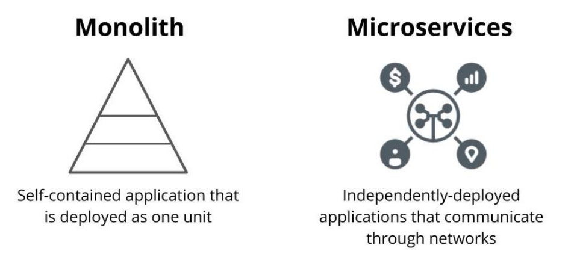
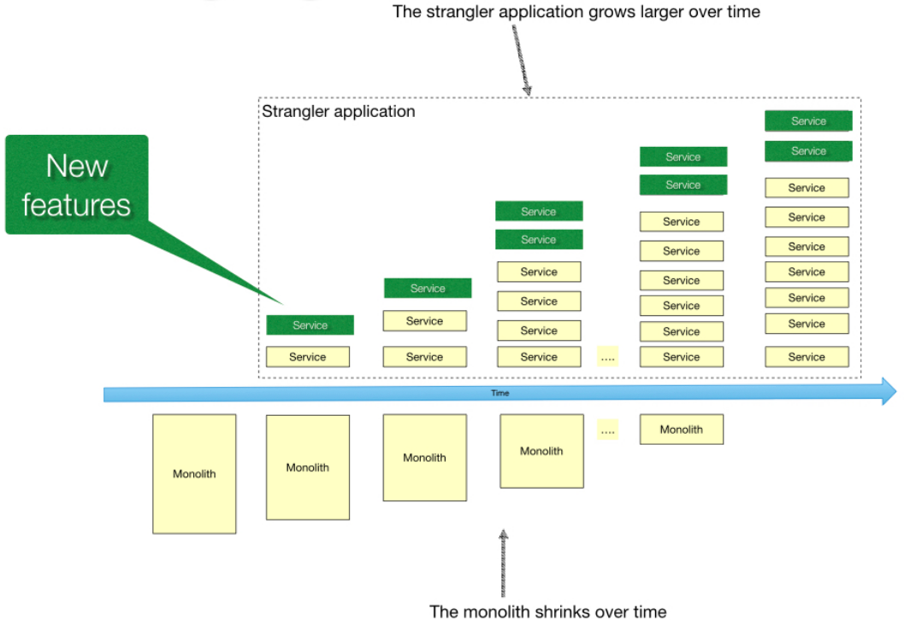
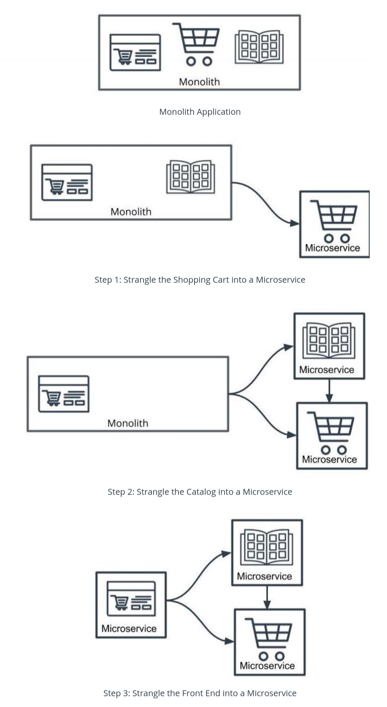
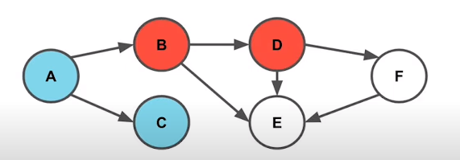

## Monolith vs Microservices

-   Microservices are an architectural style where an application is composed of modules that can be independently developed and deployed.
-   In monoliths,all the components of the application are built into a single application.

### Microservice Benefits
-   **Scale**  
    Lean applications that are able to tailor their logic and infrastructure to their specific business needs. More-easily architected for horizontally-scaling.      
-   **Development in Parallel**  
    Teams can develop and deploy their own codebases.      
-   **Cost Effectiveness**  
    Utilize resources only for what is necessary for the specific microservice.      
-   **Flexibility**  Choose technologies that make the most sense for the team and business.

## Microservice Architecture Designs
In software, different forms of designs can meet the same requirements. This means that your software architecture diagram is likely to not look exactly like another that is trying to achieve the same purpose. They may address the same business requirements but some different technologies may be used. Or, they may optimize for different parts of the business such as cost and speed of development.

### Properties of Microservices
#### Communication
-   Services communicate through a network
-   REST is currently the most-commonly used network interface

#### Independently Deployed
-   Deployment to one service should not affect another

#### Fault tolerant
-   Diligence in writing code that can anticipate when another microservice isn’t working

### Key Terms
- REST - Architectural style of communication across a network
- Fault Tolerance - The ability to continue operating in the event of a failure
- Vertical Scaling - Scaling by increasing the capacity of existing machines
- Horizontal Scaling - Scaling by adding more machines

### Alternatives to REST
While REST is the most popular form of network communication used for microservices, there are many other protocols that can be used. The following are some other ways microservices can communicate with one another:

-   [Publish-Subscribe](https://blog.opto22.com/optoblog/request-response-vs-pub-sub-part-1)
-   [Queues](https://peterdaugaardrasmussen.com/2018/08/27/should-you-use-mq-brokers-or-web-services-and-how-they-are-different/)
-   [gRPC](https://grpc.io/)
-   [SOAP](https://en.wikipedia.org/wiki/SOAP)
-   [GraphQL](https://graphql.org/)

### Other
The following has some more context on microservices in greater detail.

-   [More on Microservices](https://martinfowler.com/articles/microservices.html)

## Divide Into Microservies
### [Strangler Pattern](https://martinfowler.com/bliki/StranglerFigApplication.html)
- Common way to migrate legacy applications
- Gradually replace components of the application - Modernize an application by incrementally developing a new (strangler) application around the legacy application.
- The strangler application consists of two types of services. First, there are services that implement functionality that previously resided in the monolith. Second, there are services that implement new features.
- Named after the Strangler Fig
	> [Strangler figs](https://en.wikipedia.org/wiki/Strangler_fig), seed in the upper branches of a tree and gradually work their way down the tree until they root in the soil. Over many years they grow into fantastic and beautiful shapes, meanwhile strangling and killing the tree that was their host.

### Using the Strangler Pattern

### Map Your Dependencies
-   It's important to understand the application before breaking it apart.
-   One strategy is to map out the modules and their dependencies as a directed graph to understand the downstream impact of your changes.
	- Dependency Graph is a type of diagram that maps out the relationships between components to understand which parts of the system rely on the other

### Where to Start?
-   There’s no hard rule: choose the part of the application that makes the most sense to be started.
-   **Dependency graph serves merely as a guideline on risk based on the number of dependencies.**
-   **A module with the least dependencies will potentially have the downstream effects meaning less risk.**

### How to Start?
-   The  _Strangler pattern_  is a common and effective way to migrate legacy applications.
-   Rather than replacing the code with a new version, it is possible gradually replace components of your application.

### Shared Code
-   Code duplication can be abstracted into common libraries used across projects.

## Trade-offs
Designing software is not a binary process. There's rarely a right or wrong answer and it's often a decision of balancing both technical and business tradeoffs.

Some trade-offs include

-   Cost of InfrastructureBut
-   Time of Development
-   Managing Technical Debt

#### Scope of Refactor
Microservices may not just be refactoring code. We also need to also consider other parts of the system including databases and infrastructure.
