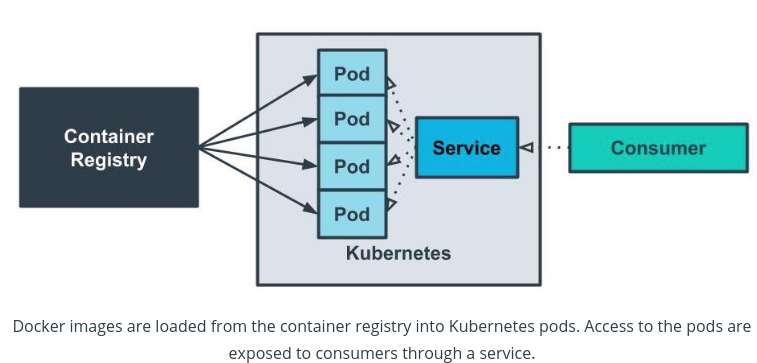
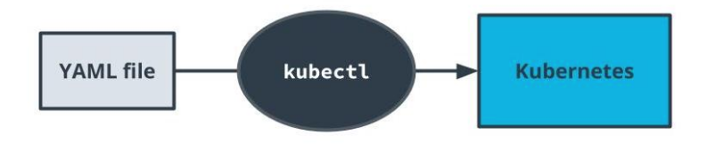

# Orchestration with Kubernetes
## Why Orchestration ?
**Orchestration is the automated management of the lifecycle of our application**

-   With CI/CD, if Travis is our CI tool, then Kubernetes is our CD tool
-   Orchestration helps us handle complicated workflows in deploying our application
	- Help with deploying
	- Help recovering from failure
	- Help with horizontal scaling
-   Helps with the automation of deployment process for continuous deployment

## Kubernates Fundamentals
### Kubernetes
-   A container orchestration system packed with features for automating our application’s deployment
-   Enables us to easily scale our application and ship new code

### Pods
-   Containers often need to communicate with one another. It's not uncommon to see a deployment involving a few containers to be deployed.
-   Kubernetes  **_pods_**  are abstractions of multiple containers and are also ephemeral.

### Services
-   Applications are often deployed with multiple  **_replicas_**. This helps with  **_load balancing_**  and  **_horizontal scaling_**.    
-   **_Services_**  are an abstraction of a set of pods to expose them through a network. They provide an interface for other applications to interface with kubernetes pods.
- Abstraction of pods and their interfaces

## Kubernates on AWS
### Key Points
-   AWS EKS is a service that we can use to set up Kubernetes.    
-   The  `deployment.yaml`  file is used to specify how our pods should be created.    
-   The  `service.yaml`  file is used to specify how our pods are exposed.

#### `deployment.yaml`
```yml
apiVersion: apps/v1
kind: Deployment
metadata:
  name: my-app
  labels:
    app: my-app
spec:
  replicas: 2
  selector:
    matchLabels:
      app: my-app
  template:
    metadata:
      labels:
        app: my-app
    spec:
      containers:
        - name: simple-node
          image: augustocalado11/simple-node
          ports:
            - containerPort: 80
      livenessProbe:
        httpGet:
          path: /health
          port: 8080
        initialDelaySeconds: 3
        periodSeconds: 3
```

#### `service.yaml`
```yml
apiVersion: v1
kind: Service
metadata:
  name: my-app
  labels:
    run: my-app
spec:
  ports:
  - port: 80
    protocol: TCP
  selector:
    run: my-app # This session is what binds the service with the deployment
```

-   `kind: Deployment`  and  `kind: Service`  denotes how Kubernetes will process the file.
-   `replicas`  specifies the number of replicas that we want. This corresponds to the number of pods that will be created for one deployment.
-   `containers`  in  `deployment.yaml`  specifies the source for our Docker image

### Creating a Kubernetes Cluster on AWS


#### Creating an EKS Cluster
1.  _Create cluster_  in EKS
2.  Create and specify role for Kubernetes cluster
	- AmazonEKSClusterPolicy
	- Make sure when creating the role and selected the use case, choose EKS-Cluster.
3.  Enable public access

[AWS - DOC Create EKS Cluster Role](https://docs.aws.amazon.com/eks/latest/userguide/service_IAM_role.html#create-service-role)

#### Creating a Node Group
1.  _Add Node Group_  in the newly-created cluster
2.  Create and specify role for IAM role for node group
	- AmazonEKSWorkerNodePolicy
	- AmazonEKS_CNI_Policy
	- AmazonEC2ContainerRegistryReadOnly

3.  Create and specify SSH key for node group
4.  Set instance type to  `t3.micro`  for cost-savings as we learn how to use Kubernetes
5.  Specify desired number of nodes
[AWS - DOC Create EKS Node Role](https://docs.aws.amazon.com/eks/latest/userguide/create-node-role.html)

## Kubernetes Cluster
using the Kubernetes command-line tool,  `kubectl`, to interact with a cluster.

### Interacting With Your Cluster
1.  [Install  `kubectl`](https://docs.aws.amazon.com/eks/latest/userguide/install-kubectl.html)
2.  [Set up  `aws-iam-authenticator`](https://docs.aws.amazon.com/eks/latest/userguide/install-aws-iam-authenticator.html)
3.  [Set up  `kubeconfig`](https://docs.aws.amazon.com/eks/latest/userguide/create-kubeconfig.html)

### Loading YAML files
-   `kubectl apply`  - create deployment and service

```
kubectl apply -f deployment.yaml
```

### Introductory Commands
`kubectl`  provides a wide range of commands to interact with Kubernetes. The following are some basic commands that we can use to interact with our current cluster.

-   `kubectl get pods`  - show the pods in the cluster
-   `kubectl describe services`  - show the services in the cluster
-   `kubectl cluster-info`  - display information about the cluster
-   `kubectl get all`
-   `kubectl apply -f <deployment, service, env-config files>`
-   `kubectl describe hpa` 
-   `kubectl logs pod-name`
-   `kubectl delete -n default deployment <list-deployments>`
-   `kubectl delete --all deployments --namespace=default`
-   `kubectl exec -it <pod>  bash`
-   `kubectl delete svc <service-name>`


**interfacing with our Kubernetes cluster with the Kubernetes command-line tool  `kubectl`. The YAML files that we created will be loaded through this tool.**

### Debugging 
To attach to a container in a pod, use the following command:

```
kubectl exec -it {pod_name} /bin/bash
```

This is a powerful tool that allows to run and test commands directly inside the context of our pods.

Similar to the command that used with Docker, try to not  rely on this command for modifying the code or state that’s running inside of the pod. The command should only be used for troubleshooting. Pods are ephemeral and a new image should be created to address any changes.

### Additional Reading
The following are some additional information on interacting with Kubernetes

-   [**Kubernetes Cheatsheet**](https://kubernetes.io/docs/reference/kubectl/cheatsheet/)
-   [`kubectl`  **Overview**](https://kubernetes.io/docs/reference/kubectl/overview/)
-   [Kubernetes API](https://kubernetes.io/docs/concepts/overview/kubernetes-api/)
-   [`kubectl`  Documentation](https://kubectl.docs.kubernetes.io/)

## Internal Communication - Kubernetes
> Our Kubernetes cluster is using a  `ClusterIP`  configuration. This means that the service is only exposed and visible to services inside of the cluster.
Other services can access one another via the name of the service. In our case, it means that instead of having to use the IP address of  `my-app-2-svc`, we can simply make requests to  `my-app-2-svc`.

### Local Requests
>As our service is not configured to accept requests outside of the service, we can’t communicate directly to the Kubernetes services. So far, we have been using  `kubectl`  to interact with the cluster on our behalf.
When verifying HTTP requests, we need to make them within the context of our Kubernetes cluster.

### Verifying Through Kubernetes
-   `kubectl exec -it <POD_NAME> bash`  of any pod to access the pod directly.
-   `curl reverseproxy-svc:8080/api/health`  to mimic an API request to the reverse proxy.

## Scaling and Self-Healing - Kubernetes
###  Self-Healing
Kubernetes deployments can be set up to recover from failure.

-   Health checks - an HTTP endpoint that must return a  `200`  response for a healthy status. Kubernetes will periodically ping this endpoint.
-   Replicas - Kubernetes will attempt to maintain the number of desired replicas. If a pod is terminated, it will automatically recreate the pod.

```
      livenessProbe:
        httpGet:
          path: /health
          port: 8080
        initialDelaySeconds: 3
        periodSeconds: 3
```

### Scaling - Horizontal Pod Autoscaler
A deployment feature that allows additional pods to be created when a CPU usage threshold is reached.

#### Commands
- Terminate a pod
	```
	kubectl delete pod my-app-2-.... 
	```

-   Create HPA    
    ```
    kubectl autoscale deployment <NAME> --cpu-percent=<CPU_PERCENTAGE> --min=<MIN_REPLICAS>
    --max=<MAX_REPLICAS>
    ```
    
-   View HPA    
    ```
    kubectl get hpa
    ```
### Additional Reading

The following are some additional resources for learning more about how we can make our deployed applications more robust:
-   [Kubernetes Health Check Best Practices](https://cloud.google.com/blog/products/gcp/kubernetes-best-practices-setting-up-health-checks-with-readiness-and-liveness-probes)

## Alternative Deployment Strategies
Kubernetes is one solution for deploying your containers. It's packed with features but can sometimes be overwhelming. Here are a few other popular technologies that are used in the industry today.

-   **AWS ECS**  
    AWS' proprietary solution that predates AWS EKS. It integrates very well with other AWS tools and is a bit more straightforward as it is not as feature-packed as Kubernetes.  
    
-   **AWS Fargate**  
    AWS tool that helps streamline deploying containers to ECS and EKS.       
    
-   **Docker**  
    It's an option to simply run the container manually with Docker. Sometimes, it's tempting to pick a shiny hot tool that may lead to overengineered architectures.