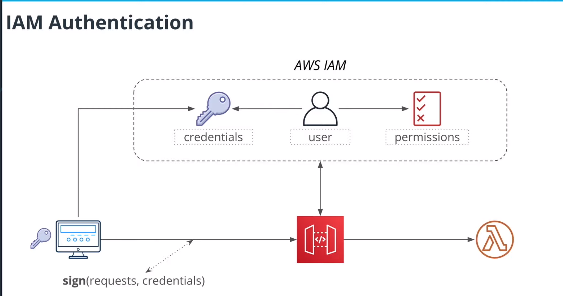
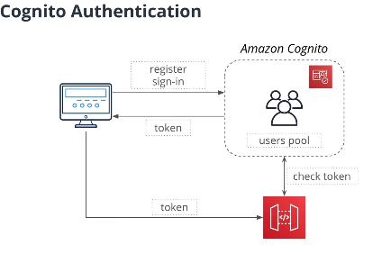
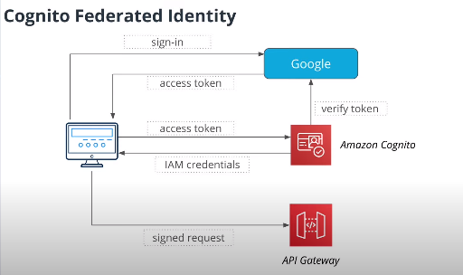
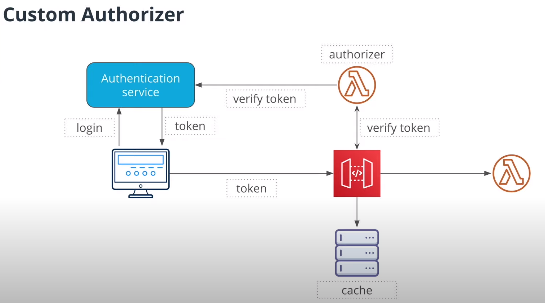
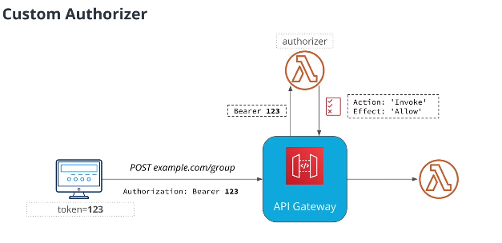
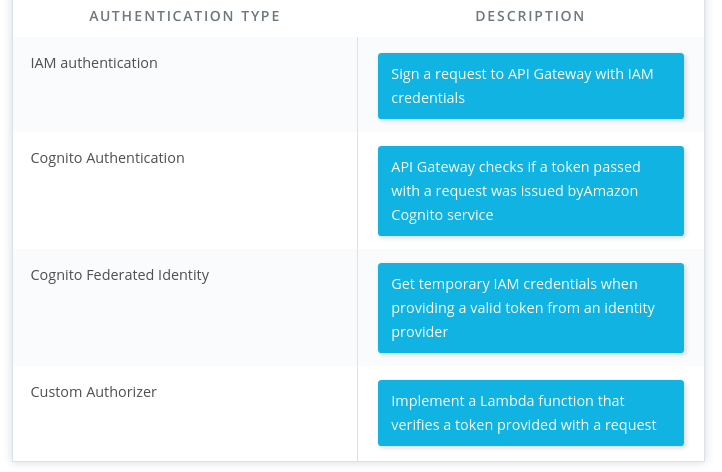

# Authentication

## Authentication with API Gateway

- API Gateway is an entrypoint to our application
- Several ways to implement authentication with API Gateway
	- IAM Authentication
	- Amazon Cognito
	- Custom Authorizer

### IAM Authentication
- Create user
- User has permissions
- User has credentials
- Use credentials of the user to sign the request
- API Gateway can validate signatrue by looking at the user credentials in AWS IAM



- How mobile/web users would store credentials?
	- Are we going to generate aws credentials for each user?
- Useful if other services call API Gateway
	-Lambda function calling API Gateway
- Need other solutins

### Amazon Cognito Authentication
- Create user pools in the cognito
- Web a user is signed-in with cognito, it will return a token
- the token can be used to call API Gateway
- API Gateway check token with amazon cognito



### Cognito Federated Identity
- if you don't want to sign-in with cognito service, you can sign-in with an ideentity provider such as Google



###  Custom Authorizer



A custom authorizer is a Lambda function that is executed before processing a request. Custom authorizer returns an IAM policy that defines what Lambda functions can be called by a sender of a request.

Notice, that the result of a custom authorizer call is cached. A good practice is to provide access to all functions an owner of a token can

Here is an example of a custom authorizer:
```
exports.handler = async (event) => {
   // Contains a token
   const token = event.authorizationToken

   // Check a token here

  return {
     principalId: 'user-id', // Unique user id
     policyDocument: {
       Version: '2012-10-17',
       Statement: [
         {
           Action: 'execute-api:Invoke',
           Effect: 'Allow',
           Resource: '*'
         }
       ]
     }
   }

 }
```

### Authentication Type and Description
