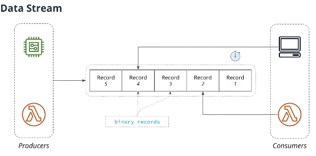
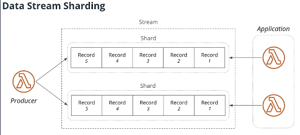

# Data-Stream
- Like a queue, but diffenrent in an important way. Unlike a queue, each recod can be read multiple times. So if one consumer read all the records on a stream so far; the data is not removed, the second consumer can still go through them and read them as well. 
- Two types of users:
	- Consumers - Read Records;
	- Producers - add new recods; 
-  A Stream is just an array of records, and in general those records are just binary data.
- The Stream dos not keep track of a position of each consumer. Instead, this responsability lies on consumers themselves
- Consumers can only append data to the end of the stream.
- Every record has an expiration time and after some time the record will be automatically removed.

## Stream is divided into multiple parts (Shard/Partition)
- Streams are splited into sharts 
- each shard will contain just part of all messages written to a data stream.

### How a Shard is Selected
- Every record has a key
- key is hashed
- Hashed key is used to select a shard

### **DynamoDB Data Stream**
