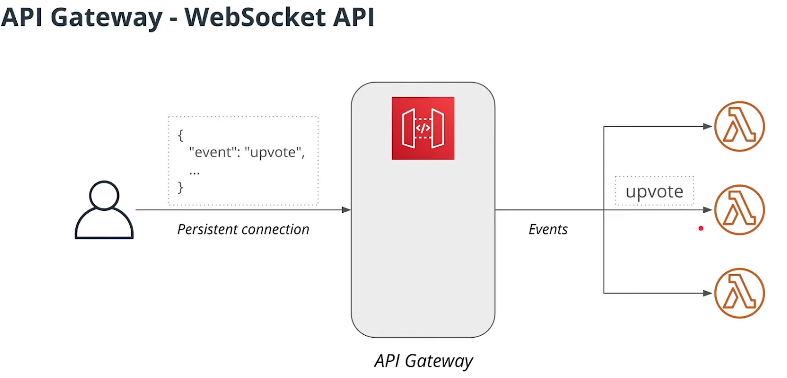
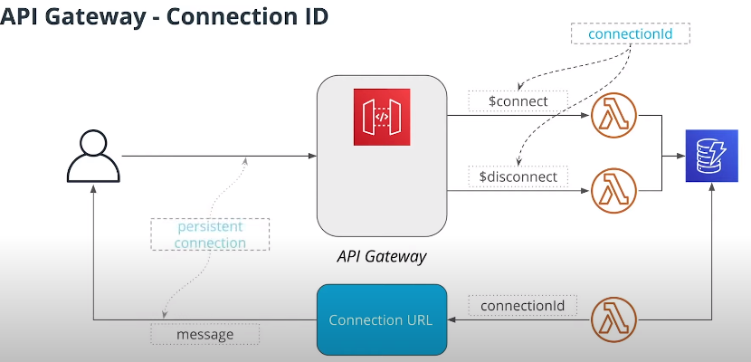

# Event Processing 

## API Gateway - WebScocket API and Lambda Functions
Lambda functions are volatile and they can be removed at anytime. So "how do we maintaint persistent connections?"

Answer: Clients will connect with API Gateway and it will maintain persistent connection. 

### How does API Gateway Decide what Lambda Function to Invoke?

#### 1. Specify a routing key in the JSON Payload sent by the client
The first option available is to specify in a JSON payload a routing key, and depending on the value of this routing key, a specific lambda function will be involked



### WebSocket UURL and Connection ID
When using REST API we had just one URL. When using WebSockets API we will have to deal with TWO URLs (1:WebSocket URL and 2: Connection URL).

**_WebSocket URL:_**
-   Clients will use to connect to the API
-   Allows clients to send messages and receive notifications

**_Connection URL_**
-   Send a message back to a connected client
-   Lambda function will use to send messages
-   Requires a connection id to send a message to a particular client

_Connection URL supports the following operations:_
-   POST: to send a message to a client
-   GET: to get the latest connection status
-   DELETE: to disconnect a client from API




## How To Test WebSocket Connections
Tool: WebSocket CLI client

**Install**
`npm install wscat -g`

**connect**
```
wscat -c wss://bblabla.amazonaws.com/dev
# <message><ENTER> to send message
```
