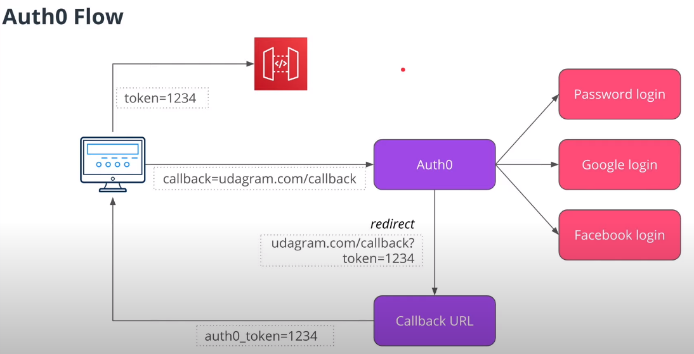
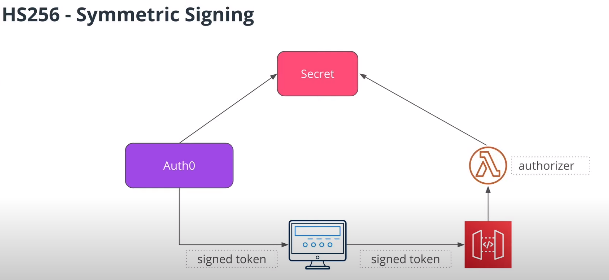

# OAuth and Auth0 Flow
## Nice Observation
- OAuth is the name of the protocol
- Auth0 is the name of the third-party service

## OAuth Flow

## Auth0 Flow

### Auth0 and Algorithms to Sign JWT Token
OAuth allows to use one of the two algorithms that it can use to sign a JWT token:

#### **Symmetric (HS256)**
-   The same key for signing a token (by Auth0) and verifying a token (by our application)
-   We need to store this key and make it available to our application
-   If this key leakes, an attacker can sign fraudulent JWT tokens.

#### **Asymmetric (RS256)**
-   Different keys are used for signing and verifying a token
-   Auth0 is responsible for storing a token

