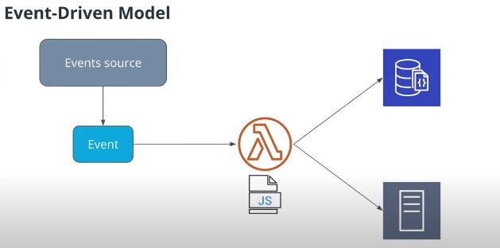
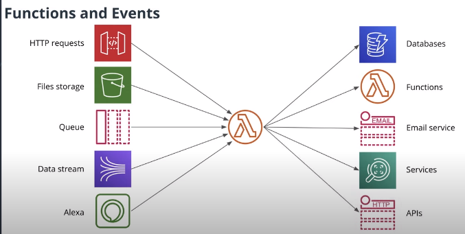
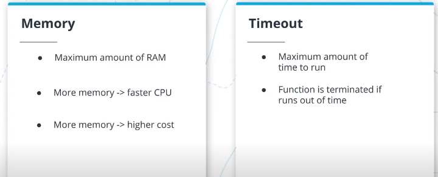
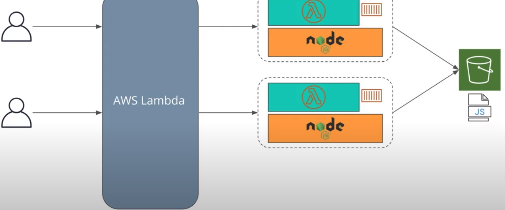
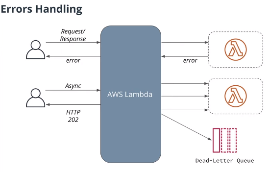
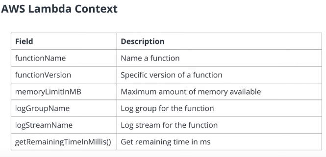

# Serveless-Introduction
## Serverless Components
-   **FaaS**  :  _Function as a service_: write code in individual functions and deploy them to a platform to be executed (AWS Lambda)
-   **Datastores**: Storage of data (Amazon S3, Amazon DynamoDB, Firebase)
-   **Messaging**: Send messages from one application to another (Amazon SQS, Amazon Kinesis, Google Pub/Sub)
-   **Services**: Services that provide functionalities where we don't need to manage servers; i.e. authentication, ML, video processing

## Function as a Service
-   Split application into small functions
-   **Event driven**
-   Pay per invocation
-   Rest is handled by a cloud provider



### Flow of Actions and Reactions


### Use-cases for FaaS
- Build Mobile and Web Backends
- Real-time Streaming - Attach functions to real time event sources and the function will be executed when the next message or next event is added to queue 
- Files Processing - When a new file is uploaded and the functions can react to this event.
- Services "glue"
	- Receive events from services
	- Interact with other services accordingly
		- Send a Slack notification if a host is terminated
	
## Lambda function vs AWS Lambda
Keep in mind that **AWS Lambda is a computing service** that runs code in response to events from Amazon Web Services, while a **Lambda function is a single function connected to an event source running in AWS Lambda**.

### Example of a Function (AWS Lambda)

In order to make the function available for AWS Lambda, it is necessary to export it and assign it to a field in the exports object.

The name of the field that received the assignment is going to be the name of the function that will be exported from a file.

```js
exports.handler = (event) => {
	const number = event.number
	const updatedNum = number++
	
	return {
		result: updatedNum
	}
}
```

### Main Parameters of Concern for AWS Lambda


### AWS Lambda limitations
-   At most 3GB of memory per execution
-   Functions can run no more that 15 minutes
-   Can only write files to  `/tmp`  folder
-   Limited number of concurrent executions
-   Event size up to 6 MB

PS: Keep in mind that those limits are subject to change. You can find most recent AWS Lambda limits [here](https://docs.aws.amazon.com/lambda/latest/dg/limits.html).

## How functions are executed
When a request is sent to execute a Lambda function, AWSLambda creates an environment to run that function. It starts a container for the specific environment and loads the function code into the environment. Then it sends an event to our function. The same process is repeated for all the other requests coming in.



### Functions are Volatile
- Will be kept for 10-15 minutes
	- Rotated after ~4hours even if used
	- Can't have a ppermanent state
	- Can't maintain persistent connections
	- Should use other services to maintain state

### Concurrency Control is Good
- At most 1000 concurrent executions by default
- Is a good thing because it can overwhelm other services

## Invocation Types
In this demo we show how to invoke a function using AWS CLI.
To recap, there are 3 invocation types:
-   Request/response
	```
	$ aws lambda invoke --function-name hello-world \
	--invocation-type RequestResponse \
	--log-type Tail --payload '{"name": "Aws lambda}' \
	 result.txt
	```
	- `result.txt` is where the output of the call will be written

-   Asynchronous invocation
	```
	$ aws lambda invoke --function-name hello-world \
	--invocation-type Event \
	--log-type Tail --payload '{"name": "Aws lambda}' \
	 result.txt
	```
	-	any result wont be returned from this function, since its invocation-type is `Event` and it will run the function in a asynchronous way
-   Using AWS CLI

## Erros Handling
Errors are handled differently, depending on how we execute our function.

When using the  **Request/response**  method: If there's an error in the function, then it will return immediately to the caller, which can process the error from the Lambda function.

When using the **Async**  method: Instead of returning an error to the user, AWSLambda will return HTTP 202 code to the user and it will store a request into an internal queue. Additionally, **it will try to call the Lambda function up to 3 times**. If all of those times result into an error, then it will **store the event into a "dead-letter queue"**, which stores all the events that the Lambda function failed to process.




## AWS Lambda Additional Parameters
Lambda functions can have more than one parameter. In additon to the `event` parameter, it also possible to provide the context parameter. The context parameter provides information about the lambda environment which the lambda function is running.

```js
exports.handler = function(event, context){}
``` 

