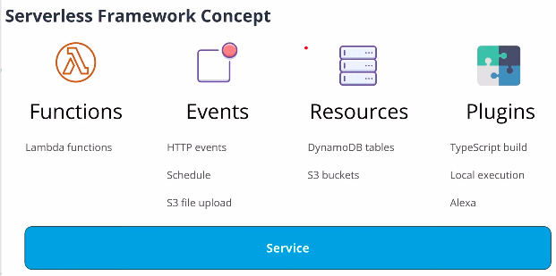
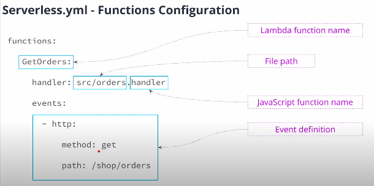
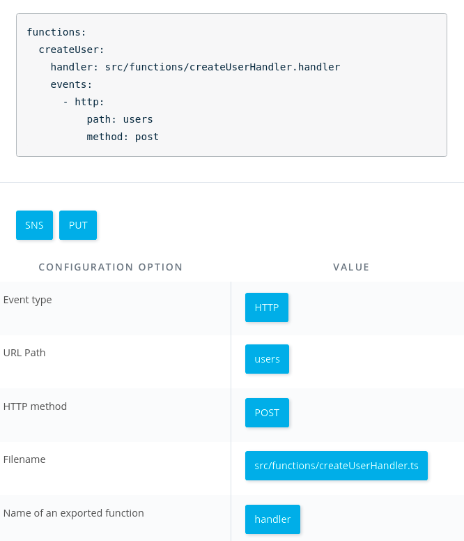
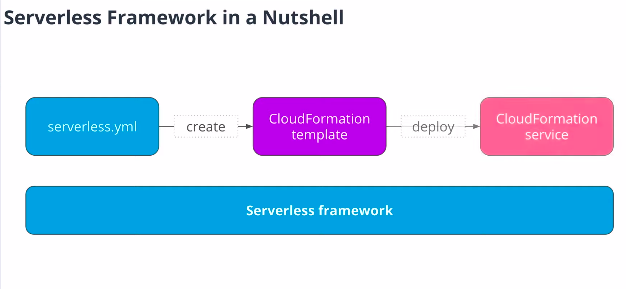
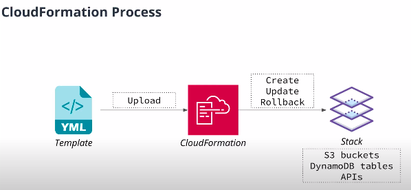
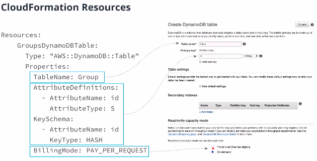
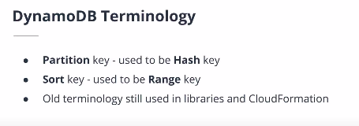
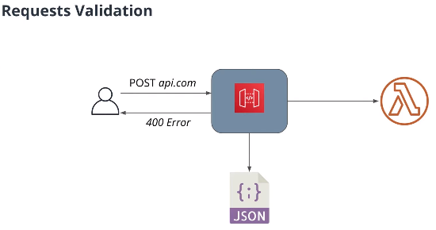
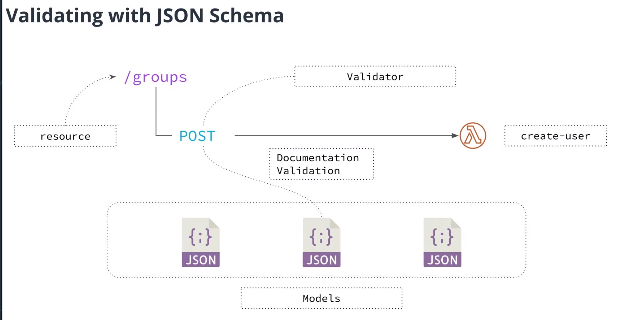

# Serverless-Framework
- Standardized way of deploying an application
- create necessary resources
- Manage applications
	- remove applications, call functions, run application locally
- May allow to implement applications
	- in different languages
	- for different cloud providers
	- On-premise serverless frameworks



### Serverless Project Structure
```
/node_modules
	-   plugins, prod. and dev. dependencies
/src
	-   function.js
serverless.yml
package.json
package-lock.json
```

### The `serverless.yml` Structure
- Provider - provider specific config
	```
	service:
		name: serverless-app
	provider:
		name:aws
		runtime: nodejs8.10
		region: 'us-east-1'
		environment:
			GROUPS_TABLE: Groups		
	```
- Functions - Functions in our service
- Plugins - plugins to extend Serverless framework
	```
	plugins:
		- serverless-webpack
	```
- Resources - additional clodu resources 
	```
	resources:
		Resources:
			# CloudFormation definition in YAML
	```
### Path parameter
- endpoints: `blablabla/groups/1/images`

```yml
functions:
    GetOrders:
      handler: src/images.handler
      events:
        - http:
            method: get
            path: /groups/{groupId}/images

```

### Defining `functions` in `serverless.yml`


**Example**


### Serverless Plugins
Serverless framework's functionality can be extended using dozens of plugins developed for it.
> -   When you are looking for a plugin for your project you can use the  [plugins catalog](https://serverless.com/plugins/)  on the Serverless Framework website.
> -   If you can't find a plugin that would fit your needs, you can always implement your own. You can start with  [this guide](https://serverless.com/framework/docs/providers/aws/guide/plugins#writing-plugins)  if you want to explore this option

## How Serverless framework is deploying an application?
Relies on CloudFormation Service to create all resources. CloudFormation is a service for creation and management of 
AWS resources (Amazon's version of terraform).



CloudFormation works in a declarative way, so we don't need to define how to change our infrastructure, we just need to define a state that we want to achieve.
	- Write YAML/JSON Config file
	- CloudFormation changes state of resources
	- Version control the infrastructure (it can be stored in a version controll system like git)


## CloudFormation Resources
Most of AWS resources can be created with CloudFormation, but in some rare cases there may be AWS resources that is not supported by CloudFormation. In this case use AWS API, AWS CLI or AWS dashboard.



### CloudFormation and DynamoDB Terminology


## Using Serverless Framework
**INSTALL**
```
npm install -g serverless
```

**CREATE PROJECT**
```
serverless create --template aws-nodejs-typescript --path folder-name
```

**INSTALL PLUGIN**
```
npm install plugin-name --save-dev
```

The flag `--save-dev` is used for not include de plugin when deploying a service application Serverless framework will not deploy the development dependencies with the code.


**DEPLOY PROJECT**
```
sls deploy -v
```

### Setup Serverless Framework User on AWS 
1. Go to IAM
2. Create a new user
	- Check the option programmatic access 
	- Attach AdministratorAccess policty
3. In the console `sls config credentials --provider aws --key YOUR_ACCESS_KEY --secret YOUR_SECRET_KEY --profile serverless`

## Validate Requests Using AWS API Gateway
AWS API Gateway can perform validation based on JSON Schemas. If a request has invalid body, AWS API Gateway will detect this inconsistency and return 400 immediately. Also, as the lambda function was not trigged to process a invalid request, resources were saved.



### JSON Schema
JSON Schema is a form of define structure of a JSON object.

check out at its [official documentation](https://json-schema.org/).

**Example**
```json
{
  "$schema": "http://json-schema.org/draft-04/schema#",
  "title": "my-type",
  "type": "object",
  "properties": {
    "name": {
      "type": "string"
    }
  },
  "required": ["name"]
}
```



### Instaling JSON Schema
1. installing dependencies
```
npm install serverless-aws-documentation serverless-reqvalidator-plugin --save-dev
```

2. importing in `serverless.yml`
```
plugins:
	- serverless-webpack
	- serverless-reqvalidator-plugin
	- serverless-aws-documentation
```

3. Defining **models** for the API
```
provider
	.
	.
	.

custom:
	documentation:
		api:
			info:
				version: v1.0.0
				title: Udagram API
				description: Serverless application for images sharing
		models:
			- name: GroupRequest
              contentType: application/json
              schema: ${file(models/create-group-request.json)}			

```
`custom` object allows us to specify additional configuration that is commonly used by various plugins in serverless framework.