# Servless Rest API
## API Gateway
### **What is API Gateway**
-   Entry point for API users
-   Pass requests to other services
-   Process incoming requests

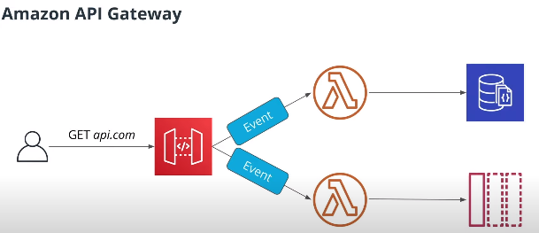

### Amazon API Gateway API Types
- REST API
	- regular HTTP API with resources and methods
	- request/response nature
- WebSockets API
	- for real-time communication between server and client
	- requires persistence connection

### Amazon API Gateway Features
- Serveless
- Monitoring
	- Logging, metrics, tracing
	- Authentication
	- Throttling
	- Integration with web application firewall WAF
	- Custom domain names - No need to use auto generated URLs if we want to expose our APIs

###  Amazon API Gateway Integration Types
- Target for an HTTP request
	- Lambda function - call a lambda function
	- HTTP Endpoint - Call a public HTTP endpoint
	- AWS Service - Send a request to an AWS service
	- Mock - Return a response without calling a backend
	- VPC Link - Acess resources in an Amazon Virtual Private Cloud (VPC)

- Configured per method
	- Ex: A `get` request can call AWS Lambda function and `post` requests can call AWS services....

### Amazon API Gateway Limits
- 10.000 Requests per second
	- soft limit - can be increased
- 50 ms to 29 sec timeout
	- hard limit - bouunds can't be changed

### Amazon API Gateway Concepts 
- resources
- method

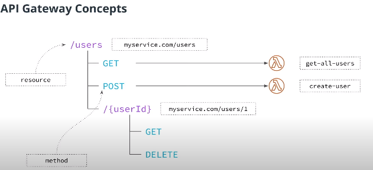

## API Gateway Configuration
- resources
- methods
- endpoint type

What endpoint type in API Gateway directs all requests through a CloudFront distribution?
- Edge Optimized

[CloudFront - CDN Definition Here](https://github.com/AugustoCalado/Cloud-Developer/blob/5cfb39635cb2009555e4d41af67c142bea374c7c/1-Cloud-Fundamentals/Storage-and-Content-Delivery.md#content-delivery-in-the-cloud)


### **Lambda integration modes**

-   **Proxy**  - passes all request information to a Lambda function. Easier to use.
-   **Non-proxy**  - allows to transform incoming request using  **Velocity Template Language**

### Proxy
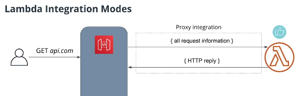

#### Proxy HTTP Request Event Format Fowarded from API Gateway
```json
{
	"path": "/users/1",
	"headers":{
		"Accept": "application/json"
	},
	"httpMethod": "GET",
	"pathParameters": {"userID":"1"},
	"body": ""
}
```

#### HTTP Reply for the API Gateway
```
exports.handler = async (event) => {
	return {
		statusCode:200,
		headers: {
			"Cache-control": "max-age="120"
		},
		body: JSON.stringify({
			"result": 42
		})
	}
}
```

###  Non-Proxy


In this integration mode, when API Gateway receives a request it converts this request object into event of a different shape using `mapping template`. When the lambda function returns a reply, this reply is now passed to a different mapping template and this replies converted into HTTP reply.

Those mapping templates are defined by the **Velocity Template Language**
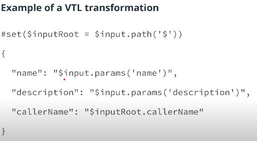

## Amazon API Gateway Setting up a stage for a REST API
A stage is a named reference to a deployment, which is a snapshot of the API.

[Documentation](https://docs.aws.amazon.com/apigateway/latest/developerguide/set-up-stages.html)

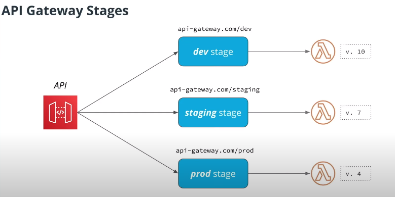

## REST API
### DynamoDB
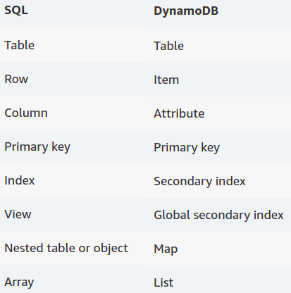

- In DynamoDB a table is splited in partitions. Amazon DynamoDB stores data in partitions. A _partition_ is an allocation of storage for a table
- if a table has a simple primary key (partition key only), DynamoDB stores and retrieves each item based on its partition key value.
- To write an item to the table, DynamoDB uses the value of the partition key as input to an internal hash function. The output value from the hash function determines the partition in which the item will be stored.
- To read an item from the table, you must specify the partition key value for the item. DynamoDB uses this value as input to its hash function, yielding the partition in which the item can be found.

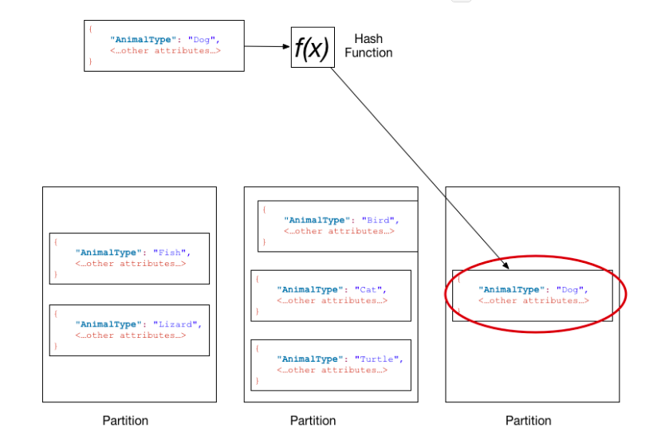

> DynamoDB is optimized for uniform distribution of items across a table's partitions, no matter how many partitions there may be. We recommend that you choose a partition key that can have a large number of distinct values relative to the number of items in the table.

**Read more in DynamoDB Doc** [HERE](https://docs.aws.amazon.com/amazondynamodb/latest/developerguide/HowItWorks.Partitions.html)

#### Partition Key
- Allows two operations
	- Getitem - get one item by key
	- Scan - get All Itens

#### Composite Key
A composite key in DynamoDB consists of two elements

-   Partition key - what partition to write item to
-   Sort key - to sort elements with the same partition key

Together - uniquely identify an item, meaning there can be no two items in a table with the same values of composite key.

NOTE. If a table has a composite key, there can be multiple items with  **the same**  partition key, providing they have  **different**  values of sort key.

Composite keys allows to perform queries, that can be used to get a subset of items with a specified partition key.

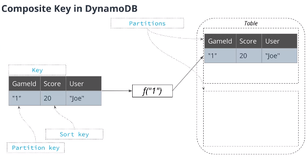

### Indexes in DynamoDB 
_DynamoDB supports two indexes types:_

Local secondary index (LSI):

-   Like an additional sort key
-   Allows to sort items by a different attribute
-   Added on the data in a table

_Global secondary index (GSI)_

-   Allows to define a new partition key for the same data
-   Allows to define a new partition and sort key for the same data
-   Creates copy of the data in a table (data is available via GSI after some delay)

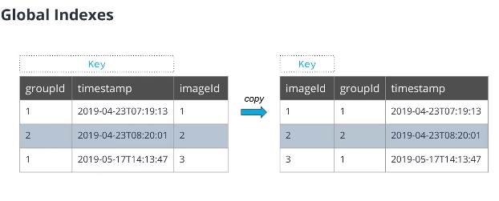

### Process to Design Tables for DynamoDB
- Think about what queries we want to perform
- Design a table to perform these queries

### DynamoDB Capacity Modes
DynamoDB has two capacity modes:
-   **Provisioned capacity**  - we need to define the maximum amount of read/write requests DynamoDB can handle. The higher the limit we set, the more we have to pay per month. Requests are throttled if we go above the specified limit.
-   **On-Demand**  - DynamoDB will handle as many requests as we send, and we pay per-request. Can be more expensive comparing to Provisioned capacity, but is better for applications with unpredictable traffic patterns.

### DynamoDB Data Stream Diagram
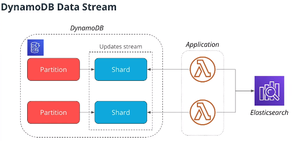

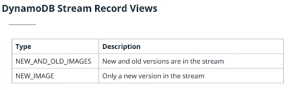

### DynamoDB with Node.js
```js
const doClient = new AWS.DynamoDB.DocumentClient()

doClient.scan({ //Call Parameters
		TableName: "Users",
		Limit: 20
	},
	(err, data) => { //Called when Scan is finished
		// Process data or error
	}
)
```

**With Async/Await Feature**
```js
const doClient = new AWS.DynamoDB.DocumentClient()

const result = await doClient.scan({ //Call Parameters
		TableName: "Users",
		Limit: 20
}).promise()
```

**Query with Node.js**
```js
const docClient = new AWS.DynamoDB.DocumentClient()

 const result = await docClient.query({
   TableName: 'GameScore',
   KeyConditionExpression: 'GameId = :gameId',
   ExpressionAttributeValues: {
     ':gameId': '10'
   }
 }).promise()

 const items = result.Items
```