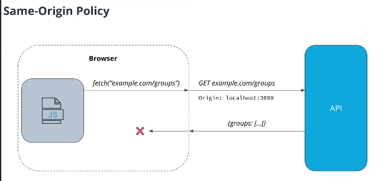
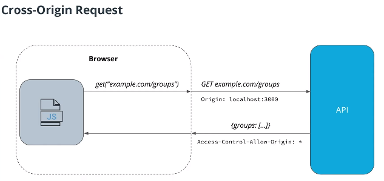

## Single-Origin Request Policy
This policy is enabled in all browsers by default.

When a browser downloads each JavaScript file, it remembers from what domain those javascripts files was downloaded. Then when in the browser this javascript code tries to perform a request to another domain, then this request is blocked by our browser.

As you can se in the image, the browser "noticed" that a request went to different domain then it will look the return from looking for a special header, and if it is not in the response the browser just blocks the reply. 

## Cross-Origin Request Policy
Need to configure Cross-Origin request policy in the API

### `Acess-Control-Allow-Origin` Values
- `"*"` wildcard for all domains
- `<hostname>:<port>` to restrict to a specific domain